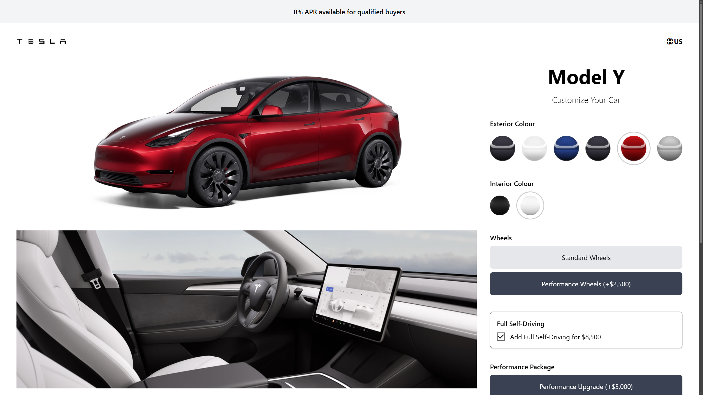
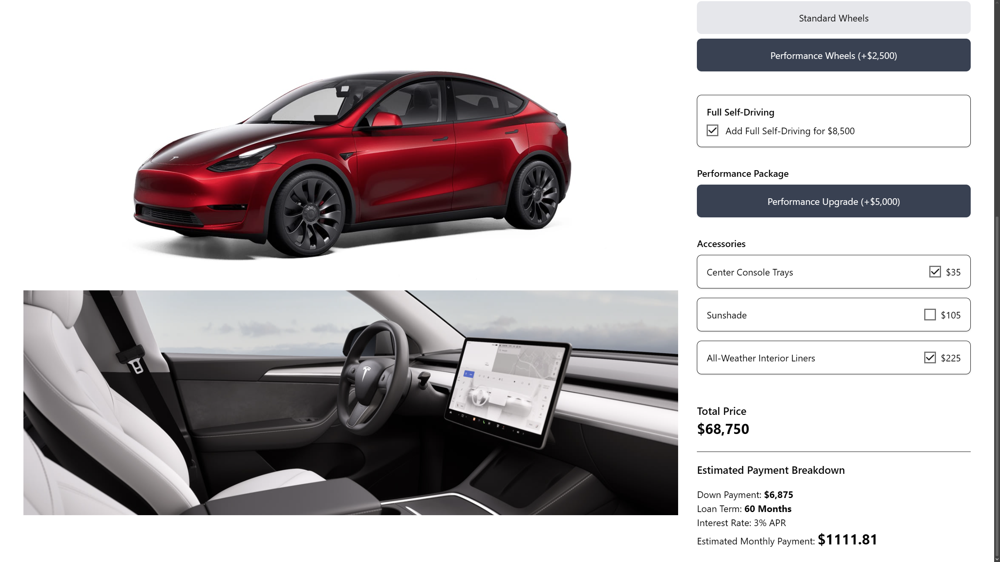

# Tesla-Car-Configurator

**Tesla-Car-Configurator** is a front-end web project that mimics a simple Tesla vehicle configurator. Users can switch between options like colors, wheels, and trims and see the configuration and pricing update instantly. The focus is on a smooth, responsive UI similar to modern car configurator pages.

[Click to view the website](https://adyan5786.github.io/Tesla-Car-Configurator/)

## Features:
- **Interactive Options:** Change model presets, colors, wheels, and more with instant visual updates.
- **Dynamic Pricing (If Implemented):** Base price and option costs update to reflect a running total.
- **Responsive Layout:** Works across desktop, tablet, and mobile.
- **Simple Navigation:** Clear sections for overview, configuration, and summary.
- **Real-Time Feedback:** JavaScript-driven DOM updates on each selection.
- **Modern Styling:** Built with utility-first **Tailwind CSS** (and optional custom styles) for a clean, automotive-inspired UI.
- **Client-Side Only:** Pure front-end, ideal for GitHub Pages or other static hosting.

## Technologies Used:
- **HTML:** Page structure and content.
- **JavaScript:** Configuration logic, state handling, and DOM updates.
- **CSS / Tailwind CSS:** Layout, spacing, typography, and responsive design.

## Screenshots

Tesla Car Configurator
 
